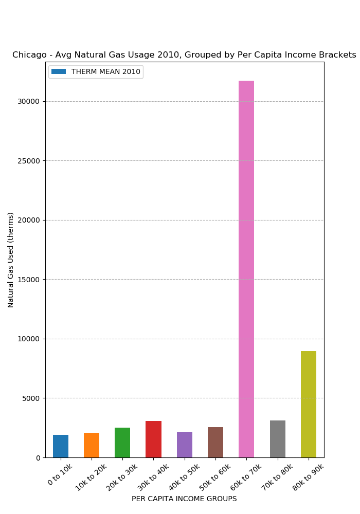

# Chicago_Energy
Examining 2010 electricity and heating usages across Chicago neighborhoods factoring in building type, household income, time of year and average building age. 

## Chicago Data Portal 
* Energy usage - "Energy Usage 2010" csv
* Income Level - "Public Health Statistics- Selected public health indicators by Chicago community area" csv

## Analysis
Background: Chicago is made up of 77 community areas that each contain multiple neighborhoods. 

#### Energy usage by neighborhood
  - Grouped community areas by regional areas of Chicago ie. Westside, Northside, Southside and Downtown.
  - Downtown has the lowest population but uses more energy than the Soutside and Westside combined. 
  - 
  - 
  
#### Energy usage based on income level
  - Public Health Statistics csv included data on Chicago Income levels based on community areas
  - Per Capita Income (PCI) bracket of 60k to 70k uses about 70 times more electricity and 15 times more natural gas than community areas' bulding with a PCI of 10k to 20k. 
  - 
  - 
  
#### Energy usage based on building type
  - Based on six building types where about 39% of buildings are categorized as "Single Family"
  - Commercial buildings consumed the most electricity in 2010 even though they only accounted for 11.6% of the total buildings in Chicago
  - 
  
#### Energy usage based on season
  - Sepearate data into seasons based on 'Therm per Quartile'
  - Spring and winter seasons account for about 81% of the total natural gas used in Chicago in 2010
  - 
